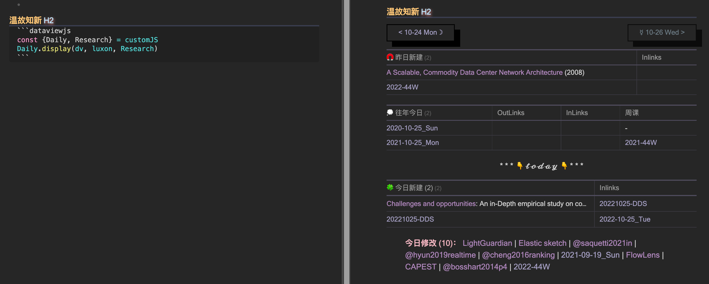
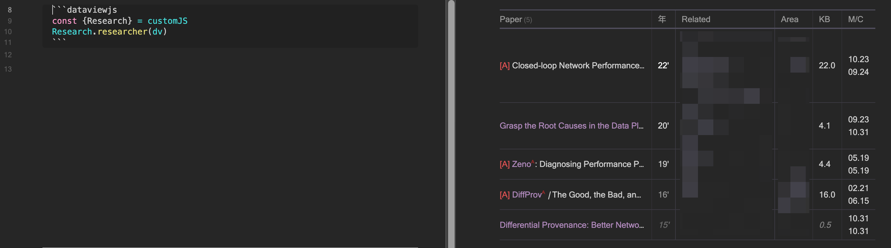

# obsidian-dataview.js
JavaScript scripts with Dataview and CustomJS plugins in Obsidian.app

The plugins that you must install: [Dataview](obsidian://show-plugin?id=dataview), [CustomJS](obsidian://show-plugin?id=customjs)

You can modify the parameters as your wishes, including the diary file name format, the time that ends the day, etc..

## Daily Diary

It will display three tables:
- The notes that were created yesterday
- The notes that were created today
- The diaries in the same day but past years

And the files that were modified today.

Note that the "today" ends at 4:00 a.m..

## Researcher

List the papers that were wrote by the researcher. The file name is the name of the researcher. The notes of papers exist in Obsidian and link to the researcher (so the the files can be queried). [Citations](obsidian://show-plugin?id=obsidian-citation-plugin) plugin is strongly recommended.

